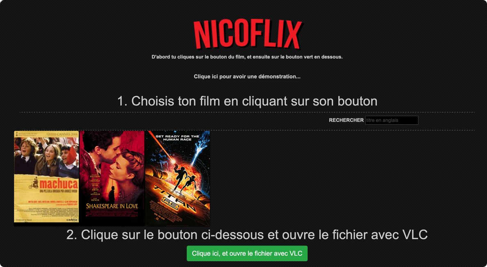

# NikOFlix


Projet perso de fork de NetFlix réalisé pendant le confinement.



# Installation des dépendances

```bash
# Via npm
npm install

# Via yarn
yarn install
```

# Configuration

NikOFliX fait appel à des API pour les affiches et les titres des films.
Vous devez saisir vos clés API dans le fichier **.env** (recopiez le contenu du fichier **.env.sample**)

- https://www.omdbapi.com
- https://www.themobiedb.org

```dotenv
# API KEY TheMovieDatabase
API_KEY_TBDB=""

# API KEY OMDB
API_KEY_OMDB=""
```

# Lancement

```bash
node streaming.js
```

Pour lancer une version **monitorée**, ie qui se recharge à chaque modification du code.

```bash
nodemon
```

# Parcours du dossier

Le script va parcourir le dossier **MOVIES_AND_SERIES** à la recherche de fichiers .avi ou .mkv.